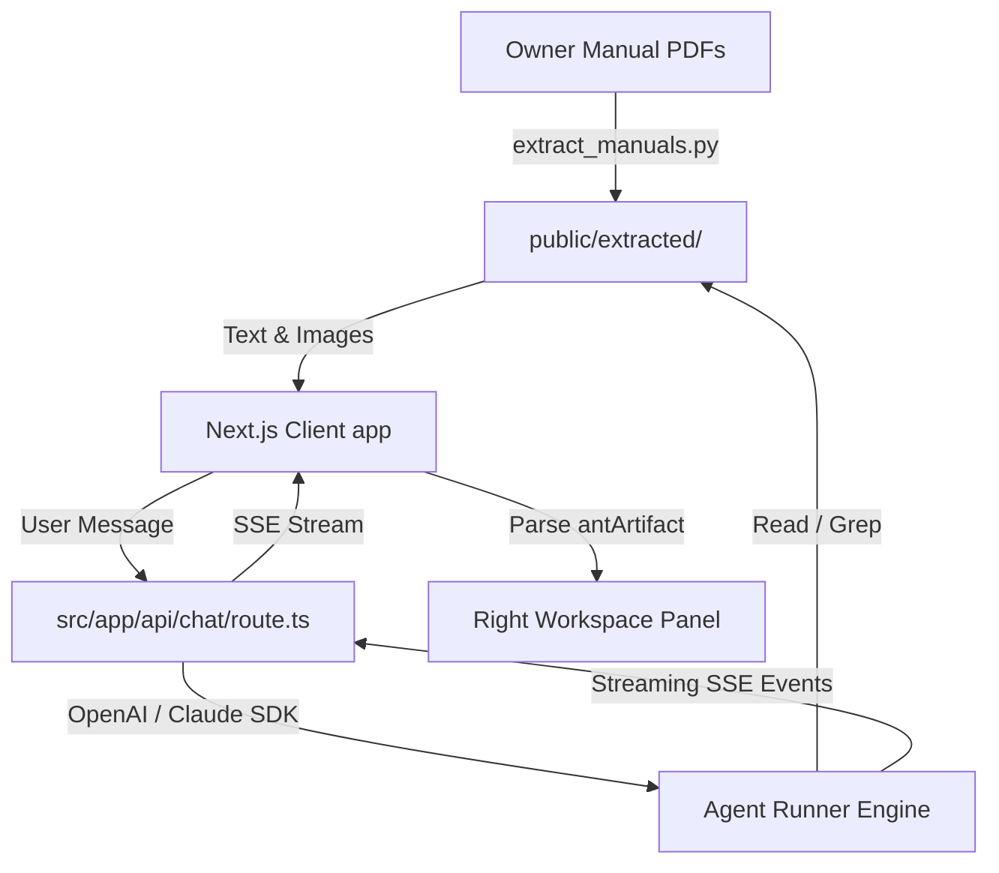

# Vulcan OmniPro 220 — AI Welder Console

An intelligent, multimodal reasoning agent workspace designed for the [Vulcan OmniPro 220 multiprocess welder](https://www.harborfreight.com/omnipro-220-industrial-multiprocess-welder-with-120240v-input-57812.html). Powered by the **OpenAI and Anthropic Agent SDKs** and built on Next.js, this application helps users set up, configure, and troubleshoot their welder directly from an interactive dashboard.

 

---

## Key Features

1.  **Deep Technical Accuracy**: The agent queries page-level markdown manuals dynamically using the Agent SDK's `Read` and `Grep` search tools, verifying exact amperage settings, polarity configurations, and duty cycles.
2.  **Live Action Telemetry Logs**: Real-time logging of the agent's reasoning process and tool runs is displayed in the workspace, letting you see exactly what page the agent is checking.
3.  **Industrial Garage Theme**: High-contrast, custom-designed dark theme (deep carbon backgrounds, yellow warning stripes, plasma orange highlights, and green glowing LCD telemetry tags).
4.  **AI Artifact Sandboxes**: Rich sandboxed visualizers that parse custom `<antArtifact>` streams from the agent and render:
    *   **Interactive React Components** (`application/vnd.ant.react`) using `react-runner` to mount fully functional calculators, joint layout selectors, and weld thickness configurators.
    *   **Mermaid Flowcharts** (`application/vnd.ant.mermaid`) for guided step-by-step diagnostic paths.
    *   **Vector SVGs** (`image/svg+xml`) of socket pins and cables setup.
    *   **HTML Frames** (`text/html`) for styled custom preview pages.
5.  **Manual Page & Asset Explorer**: Browse manual contents and extracted page images (like weld defect pictures from page 38) side-by-side with the active assistant chat.

---

## Getting Started

Follow these steps to run the application locally.

### 1. Prerequisites
Ensure you have **Node.js (v20+)** installed on your system. *(Note: The manuals have already been pre-extracted, so Python is not required to run the app).*

### 2. Install Dependencies
Clone the repository and install npm packages:
```bash
npm install --legacy-peer-deps
```

### 3. Configure Environmental Variables
Copy the `.env.example` file to `.env` and plug in your Anthropic and OpenAI API Keys:
```bash
cp .env.example .env
```
Open `.env` and edit:
```
ANTHROPIC_API_KEY=your-api-key-here
OPENAI_API_KEY=your-api-key-here
```

### 4. Launch the Server
Start the Next.js development server:
```bash
npm run dev
```

Open [http://localhost:3000](http://localhost:3000) in your browser to start using the console.

### Optional: Re-Extracting the Manuals
If you want to update the manuals or run the extraction pipeline yourself, you'll need **Python (v3.10+)** installed.

1. Install Python PDF extraction dependencies:
```bash
python -m pip install pypdf pymupdf
```

2. Run the pre-processing extraction script. This parses the manual PDFs from `files/` page-by-page, extracts text files, pulls out the schematic diagrams, and indexes keywords:
```bash
python scripts/extract_manuals.py
```

---

## Workspace Architecture



### Key Source Files
*   [extract_manuals.py](scripts/extract_manuals.py): Pipeline parsing PDFs into structured pages and image assets.
*   [route.ts](src/app/api/chat/route.ts): Connects to the OpenAI and Claude Agent SDKs, restricting them to manual reading tools. Secured with path-traversal sanitization and bad request handling.
*   [page.tsx](src/app/page.tsx): Main console interface containing chat, tool logs, manual explorer, and sandbox preview tabs. Rebuilt with optimized React hook memoization and custom error UI banners.
*   [globals.css](src/app/globals.css): Visual style system containing colors, telemetry glow styling, and warning hazard striping.

---

## Polished Architecture & Security

This workspace has been polished and refactored for production-grade presentation:
- **Type Safety**: Fully validated TypeScript compilation for OpenAI and Anthropic API message-routing loops.
- **Directory Isolation**: Hardened server-side file access endpoints. Both page lookup and keyword scanning scripts ensure target paths resolve strictly within the static manuals folder, preventing arbitrary path traversal.
- **Payload Verification**: API endpoints safely parse request streams and return descriptive bad request headers instead of generic uncaught exceptions.
- **React Hook Stability**: State callbacks and rendering utilities are wrapped in stable, dependency-tracked `useCallback` hooks, avoiding stale scopes and minimizing DOM diff operations.
- **Polished Errors**: Network and completion failure states are gracefully mapped to structured danger alert UI components instead of raw trace messages.

